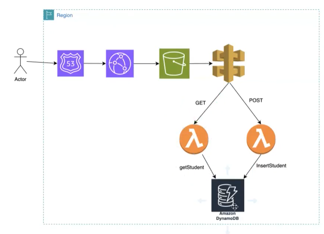
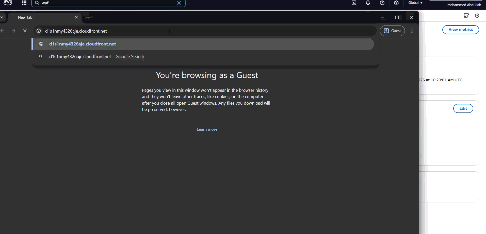
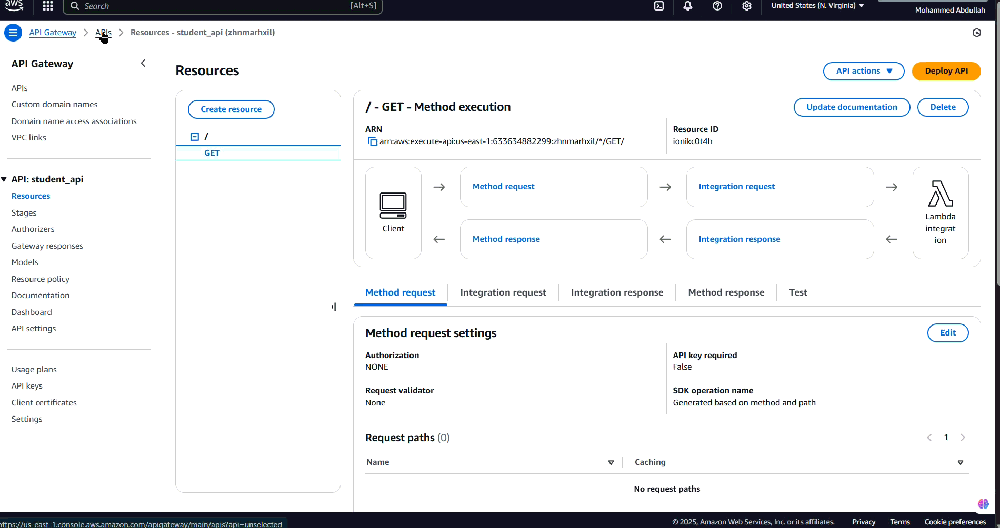
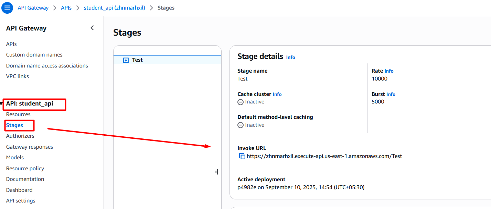
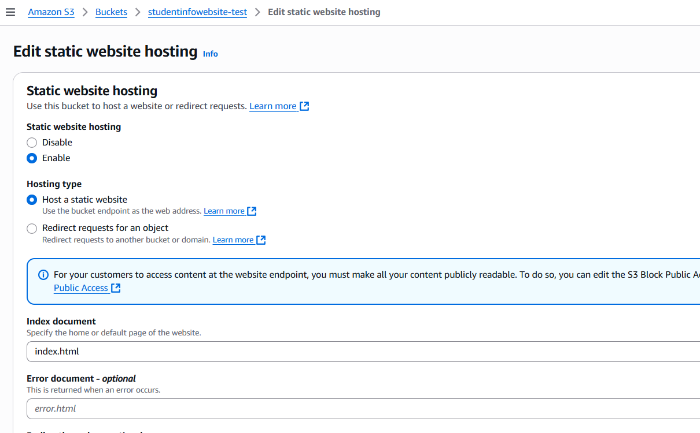
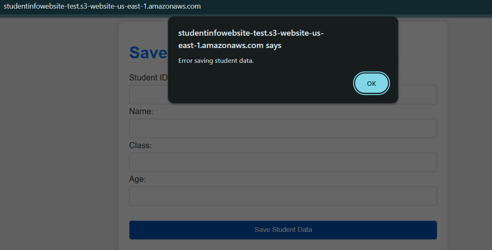
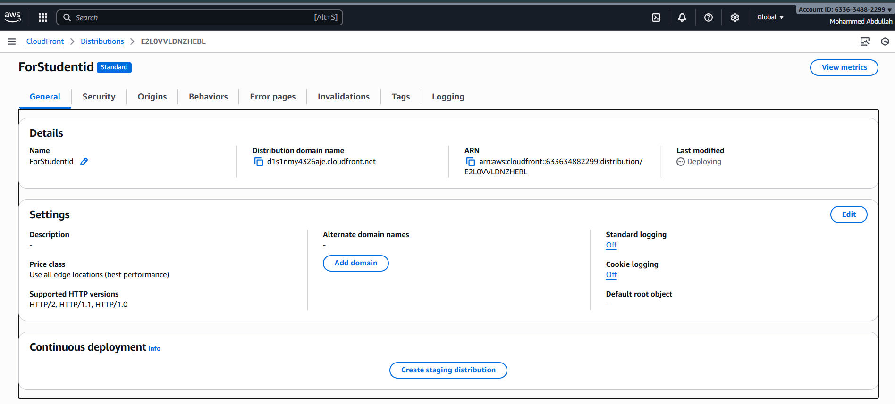
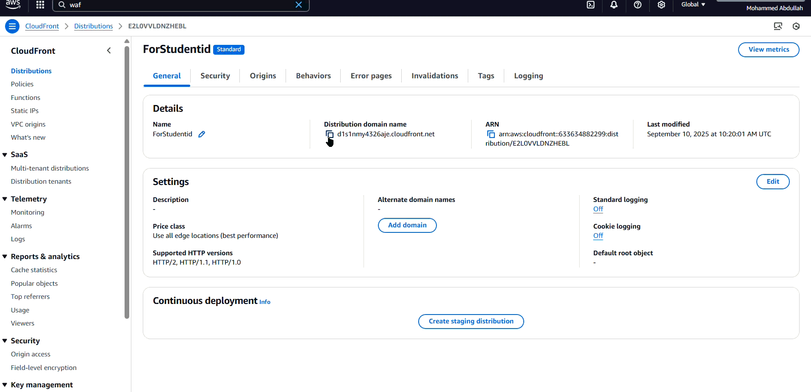
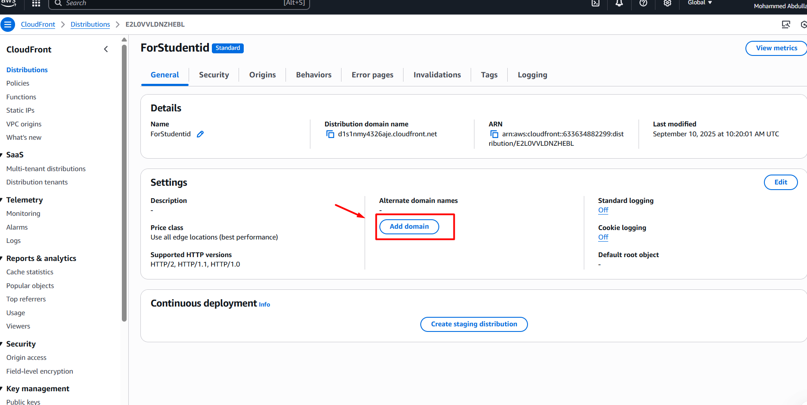

# AWS Serverless 3 tier Architecture

This guide walks you through building a complete serverless student management system using AWS services. The system allows users to store and retrieve student information through a web interface.

## Architecture Overview

**Why this architecture?** This serverless architecture provides:
- **Scalability**: Automatically scales based on demand
- **Cost-effectiveness**: Pay only for what you use
- **High availability**: AWS manages infrastructure redundancy
- **Security**: Built-in AWS security features

**Components:**
- **Frontend**: Static website hosted on S3 with CloudFront CDN
- **API Layer**: API Gateway for REST endpoints
- **Compute**: Lambda functions for business logic
- **Database**: DynamoDB for data storage
- **Security**: IAM roles for permissions



 


## **Optional: You can also use main.tf to deploy the infrastructure. or use below method**

## Step 1: Create DynamoDB Table

### Purpose
DynamoDB serves as our NoSQL database to store student information. We use `studentid` as the partition key for efficient data retrieval and distribution.

### Commands

```bash
# Create the Student table with studentid as partition key
aws dynamodb create-table \
  --table-name 'Student' \
  --attribute-definitions '[{"AttributeName":"studentid","AttributeType":"S"}]' \
  --billing-mode 'PAY_PER_REQUEST' \
  --key-schema '[{"AttributeName":"studentid","KeyType":"HASH"}]' \
  --table-class 'STANDARD'
```

### Optional: Auto-scaling Configuration
```bash
# Configure auto-scaling for read capacity (if using provisioned billing)
aws application-autoscaling put-scaling-policy \
  --service-namespace 'dynamodb' \
  --resource-id 'table/Student' \
  --scalable-dimension 'dynamodb:table:ReadCapacityUnits' \
  --policy-name 'Student-read-scaling-policy' \
  --policy-type 'TargetTrackingScaling' \
  --target-tracking-scaling-policy-configuration '{
    "PredefinedMetricSpecification": {
      "PredefinedMetricType": "DynamoDBReadCapacityUtilization"
    },
    "TargetValue": 70
  }'
```

### Key Decisions Explained
- **PAY_PER_REQUEST billing**: Eliminates capacity planning and provides automatic scaling
- **String (S) attribute type**: StudentID will be alphanumeric
- **HASH key**: Ensures even distribution of data across partitions

---

## Step 2: Create IAM Role for Lambda Functions

### Purpose
Lambda functions need permissions to execute and access AWS services. We create a dedicated role following the principle of least privilege.

### Steps
1. **Navigate to IAM Console** → Roles → Create Role
2. **Trust Entity**: Select "Lambda" (allows Lambda service to assume this role)
3. **Role Name**: `studentlambdarole`
4. **Attach Policies**:
   - `AWSLambdaBasicExecutionRole` - Basic Lambda execution permissions
   - `AmazonDynamoDBFullAccess` - Read/write access to DynamoDB tables
5. **Description**: "Allows Lambda functions to call AWS services on your behalf"

### Why These Permissions?
- **AWSLambdaBasicExecutionRole**: Enables Lambda to write logs to CloudWatch
- **AmazonDynamoDBFullAccess**: Allows Lambda to read from and write to DynamoDB tables

**Security Note**: In production, replace `AmazonDynamoDBFullAccess` with a custom policy that grants access only to the specific `Student` table.


---

## Step 3: Create Lambda Function for Reading Data

### Purpose
This Lambda function retrieves student information from DynamoDB when called through API Gateway.

### Configuration
- **Function Name**: `getStudent`
- **Runtime**: Python 3.13
- **Architecture**: x86_64
- **Execution Role**: `studentlambdarole` (created in Step 2)

### Lambda Function Code (Python-get-Student.py)

### Deployment
1. **Copy the code** into the Lambda function editor
2. **Update table name** if different from 'Student'
3. **Click "Deploy"** to save changes

---


## Step 4: Create Lambda Function for Writing Data

### Purpose
This Lambda function inserts new student records into DynamoDB when called through API Gateway.

### Configuration
- **Function Name**: `insertStudent`
- **Runtime**: Python 3.13
- **Architecture**: x86_64
- **Execution Role**: `studentlambdarole`


```
    You can test 
    
    {
            "studentid": "002",
            "name": "test",
            "class": "6",
            "age": "age"

}

```

You should see in the DynamoDB table(under explore table option)

and retrieve same test by using the getStudent Lambda and simply click Test


---

## Step 5: Create API Gateway - GET Method

### Purpose
API Gateway acts as the front door for our REST API, routing HTTP requests to appropriate Lambda functions.

### Steps

1. **Create REST API**
   - API Name: `student_api`
   - API Type: REST API
   - Integration Type: Lambda Function
   - Lambda Function: `getStudent`

2. **Create GET Method**
   - Select the API → Create Method
   - HTTP Method: GET
   - Integration Type: Lambda Function
   - Lambda Function: `getStudent`
   - Use Lambda Proxy Integration: ✓ (enables request/response transformation)


3. **Configure Method Request**
   - Add Query String Parameter: `studentid` (required)

### Testing
1. Click "TEST" in the method execution
2. Enter query parameter: `studentid = 002`
3. Click "Test"
4. **Expected**: Returns student data from DynamoDB



### Why Lambda Proxy Integration?
- **Simplified**: Entire HTTP request passed to Lambda
- **Flexible**: Lambda handles request parsing and response formatting
- **Headers**: Automatically forwards headers, query params, and body

---

## Step 6: Create API Gateway - POST Method

### Purpose
Enables HTTP POST requests to create new student records.

### Steps

1. **Select Existing API** (`student_api`)
2. **Create Method**
   - HTTP Method: POST
   - Integration Type: Lambda Function
   - Lambda Function: `insertStudent`
   - Use Lambda Proxy Integration: ✓


3. **Test with Sample Data**
   ```json
   {
     "studentid": "003",
     "name": "test03",
     "class": "6",
     "age": "20"
   }
   ```
4. **Verify Results**
   - Check DynamoDB table for new record
   - Test GET method to retrieve the inserted data

---


## Step 7: Deploy API Gateway

### Purpose
Deployment makes your API accessible via public URLs.

### Steps
1. **Select API** → Actions → Deploy API
2. **Deployment Stage**: Create new stage (e.g., "prod")
3. **Stage Name**: `prod`
4. **Click Deploy**


## 8) Insert API URL into script.js

- Copy the API Endpoint URL



### Update API URLs
1. **Copy your API Gateway endpoints** from Step 7
2. **Replace placeholders** in `script.js` with actual URLs


## Step 9: Create S3 Bucket and Enable Static Website Hosting

### Purpose
S3 serves our static website files globally with high availability and low cost.

### Steps

1. **Create S3 Bucket**
   - Bucket name: `studentinfowebsite-test` (must be globally unique)
   - Region: Choose appropriate region
   - **Unblock all public access**: ✓ (required for website hosting)

2. **Upload Files**
   - Upload `index.html`
   - Upload `script.js`

3. **Enable Static Website Hosting**
   - Go to bucket **Properties**
   - Find "Static website hosting"
   - **Enable** static website hosting
   - **Index document**: `index.html`
   - **Error document**: `index.html` (for SPA routing)
   


4. **Configure Public Access Policy**
   ```json
   {
       "Version": "2012-10-17",
       "Statement": [
           {
               "Sid": "PublicReadGetObject",
               "Effect": "Allow",
               "Principal": "*",
               "Action": "s3:GetObject",
               "Resource": "arn:aws:s3:::studentinfowebsite-test/*"
           }
       ]
   }
   ```

5. **Apply Policy**
   - Go to bucket **Permissions**
   - Paste policy in **Bucket policy** section
   - **Save changes**

### Result
Your website is now accessible via S3 URL, but API calls will fail due to CORS restrictions.




---

## Step 10: Enable CORS on API Gateway

### Purpose
CORS (Cross-Origin Resource Sharing) allows your S3-hosted website to make API calls to API Gateway, which runs on a different domain.

### What is CORS?
When a web page loaded from one domain (S3) tries to make requests to another domain (API Gateway), browsers block these requests by default for security. CORS headers tell the browser which cross-origin requests are allowed.


And now you should be able to access to get and put the data.


### Result
Your S3 website can now successfully communicate with API Gateway.

---

## Step 11: Set Up CloudFront Distribution

### Purpose
CloudFront is AWS's CDN (Content Delivery Network) that provides:
- **Global Performance**: Caches content at edge locations worldwide
- **Security**: HTTPS encryption and DDoS protection
- **Cost Optimization**: Reduces bandwidth costs
- **Custom Domains**: Enables custom domain names with SSL

### Steps

1. **Create Distribution**
   - **Origin Domain**: Select your S3 bucket
   - **Origin Path**: Leave empty
   - **Origin Access**: Use OAI (Origin Access Identity) for better security
   - **Default Root Object**: `index.html`

2. **Distribution Settings**
   - **Price Class**: Choose based on your global reach needs
   - **Compress Objects**: ✓ (improves performance)
   - **IPv6**: ✓ (modern standard)

3. **SSL Certificate**
   - **Default CloudFront Certificate**: For *.cloudfront.net domain
   - **Custom SSL Certificate**: If you have a custom domain

4. **Cache Behaviors**
   - **Default behavior**: Cache HTML files with shorter TTL
   - **Static assets**: Cache CSS/JS/images with longer TTL
If you own a domain:

1. **Request SSL Certificate** in AWS Certificate Manager
2. **Add Alternate Domain** in CloudFront distribution
3. **Update DNS Records** to point to CloudFront distribution
4. **Verify Configuration**

### Result
Your application is now available via CloudFront with global caching and HTTPS support.

---


 
 You should be be able to access the website form the cloud front dns.

### Result
Your application is now available via CloudFront with global caching and HTTPS support.

 

 If have custom domain and have SSL cert for it then you can add that domain as alternate and use it.

 


 ---

## Cost Optimization

### 1. DynamoDB
- Use On-Demand billing for unpredictable workloads
- Use Provisioned billing for consistent traffic
- Enable DynamoDB Auto Scaling

### 2. Lambda
- Right-size memory allocation
- Use ARM-based processors for cost savings
- Implement connection pooling for database connections

### 3. S3 and CloudFront
- Use appropriate storage classes
- Set up lifecycle policies
- Configure CloudFront caching efficiently

---

## Troubleshooting Common Issues

### 1. CORS Errors
**Symptoms**: API calls fail with CORS errors
**Solutions**:
- Verify CORS is enabled on all API methods
- Check Access-Control-Allow-Origin headers
- Ensure API is deployed after CORS changes

### 2. Lambda Permission Errors
**Symptoms**: Lambda functions fail with permission errors
**Solutions**:
- Verify IAM role has necessary permissions
- Check Lambda execution role assignment
- Review CloudWatch logs for specific error details

### 3. DynamoDB Access Issues
**Symptoms**: Cannot read/write to DynamoDB
**Solutions**:
- Verify table name in Lambda code
- Check IAM permissions for DynamoDB access
- Ensure table exists in correct region

### 4. S3 Website Not Loading
**Symptoms**: S3 website returns access denied
**Solutions**:
- Verify bucket policy allows public read access
- Check static website hosting is enabled
- Ensure index.html is uploaded and named correctly

---


 
