# This will be divided in two phases


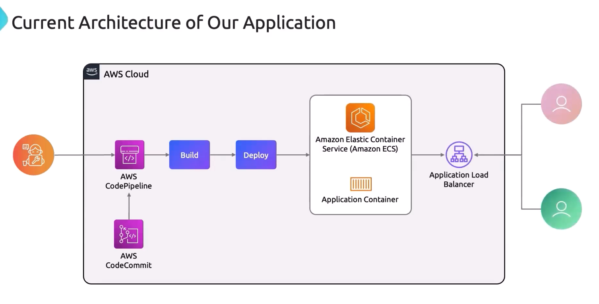

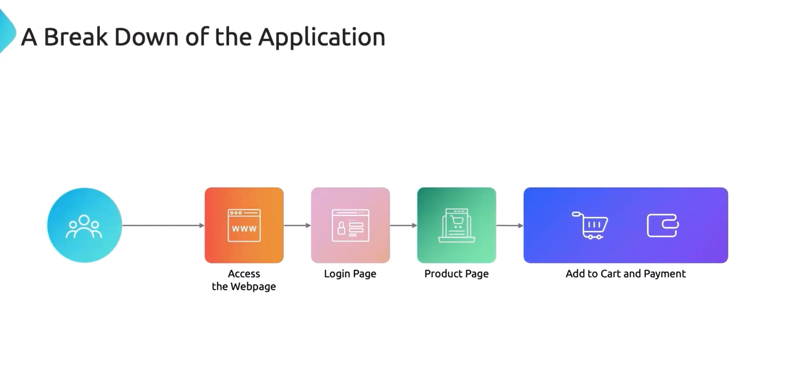


## 1) Fist testing the project locally.

## 2) Then deploying the image to ECS via ECR and accessing the environment via AWS ALP

# Phase- 01  First, Testing the Image locally

### Clone the repository:

```
git clone https://github.com/Ab-Cloud-dev/ECR-Demo.git

cd ECR-Demo/monolith-aws-microservice-project/
```

### Build the Docker Image

Navigate to the directory containing the Dockerfile and run the command.Replace your-image-name:tag with the desired name and tag for your image.

I am giving my-crypto-app as name and tag as v1

```bash
docker build . -t my-crypto-app:v1
```


## Run the Docker Container

 After building the image, run it using **docker run -d -p local-port:container-port your-image-name:tag**, adjusting local-port and container-port as necessary for your application.

```bash
docker run -d -p 3000:5000 my-crypto-app:v1
```

## Test the Application:

 With the container running, you can test your application by accessing it via the local port you specified, using tools like curl, Postman, or your web browser, depending on the nature of your application.

 I am accessing the container over the port 3000
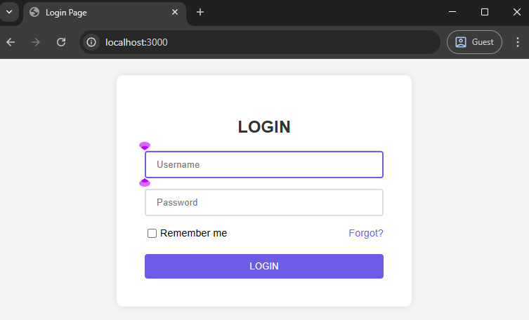

- Providing credentials

```
admin
password123
```


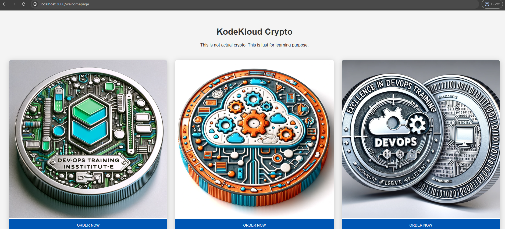


#

# <h1 style="color: yellow;">**Phase-2 Deploying the image to ECS via ECR and accessing the environment via AWS ALP**</h1>

First Create a New ECR Repository,

```
aws ecr create-repository --repository-name "crypto-app"  --image-scanning-configuration scanOnPush=true --region us-east-1
```

- Please note if you are running the above command locally then make sure to install the aws cli and configured the keys.

## Pushing the Docker image to ECR

- In the ECR registry page, select the registry created. Click on **View Push Commands** and use commands to perform the task on the terminal provided.
Authenticate the docker client to the registry created in the previous step using the below commands.

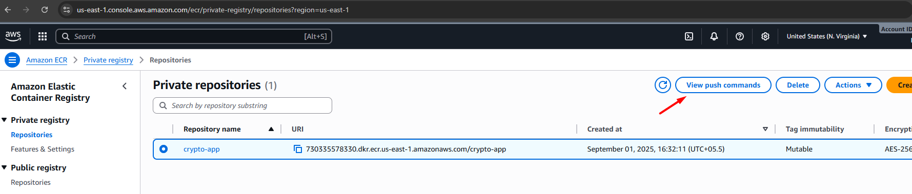

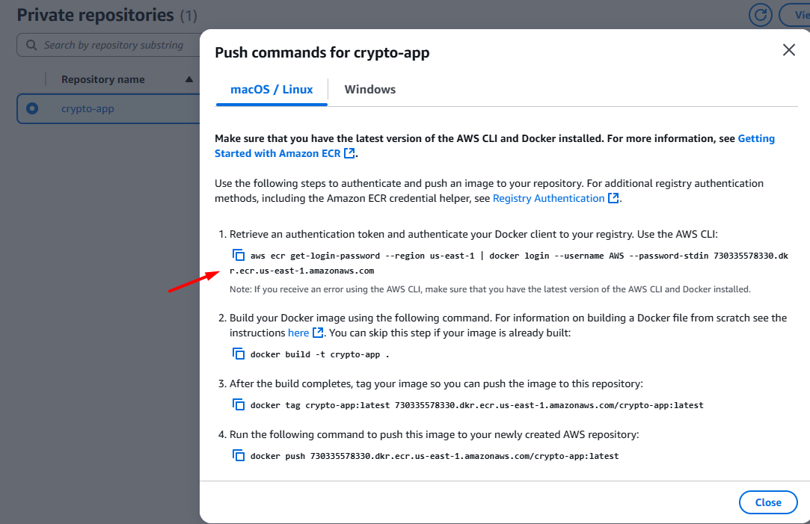


```
aws ecr get-login-password --region us-east-1 | docker login --username AWS --password-stdin <account_id>.dkr.ecr.us-east-1.amazonaws.com
```

- As we already have an image, we will be pushing the image to ECR.

- First, tag the Image built so we can push it to the specified ECR registry.

```
docker tag crypto-app:latest <account_id>.dkr.ecr.us-east-1.amazonaws.com/crypto-app:latest
```

- Then Push the image to the ECR.

```
docker push <account_id>.dkr.ecr.us-east-1.amazonaws.com/crypto-app:latest
```
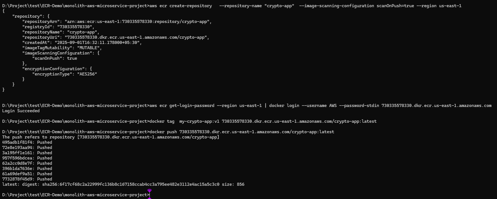


## Create an ECS Cluster

- To create an ECS cluster named microservices-cluster with the EC2 launch type, you would follow these steps in the AWS Management Console:

- Sign in to the AWS Management Console using the provided credentials.Navigate to the Amazon ECS service page. Click on "Clusters" in the left navigation pane.Click the "Create Cluster" button.
Provide the following details:


```
Cluster name: microservices-cluster
Infrastructure configuration: Amazon EC2 Instance
On-Demand Instance
Operating System: Amazon Linux 2
Instance type: t3a.micro
Instance role: Create a new role
Min/Max/Desired: 1/1/3
SSH key pair: None
Root EBS volume size: 30 GB
Networking configuration
VPC: Default VPC
Subnets: All Default Subnets or choose three subnets
Security group (Existing): Default(make sure it allows all ports)
Auto-assign public IP: Enabled
Finally, click "Create" to create the ECS cluster.
```
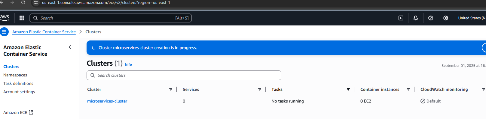


### **Create a Task Definition**

 - Create a task definition named crypto-app with the specified details, follow these steps:

- Navigate to the Amazon ECS service page within the AWS Management Console.Click on "Task Definitions" in the left navigation pane.
Click the "Create new Task Definition" button.

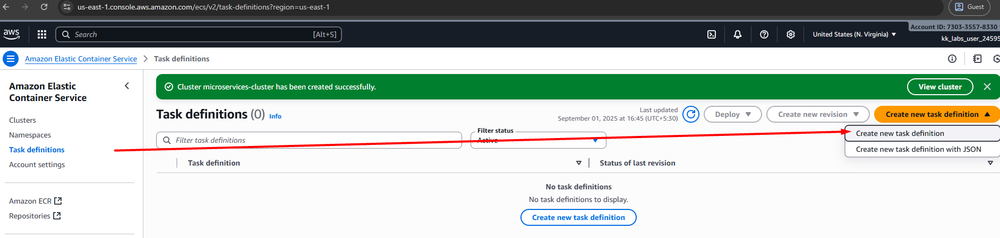


```
**Task definition configuration**
Task definition Name: crypto-app
For "Task Execution Role", select ecsTaskExecutionRole.
Set "Task memory (GB)" to 0.5 GB and "Task CPU (vCPU)" to 0.25 vCPU.
Click "Add container" to define the container for this task.
For "Container name", enter crypto-app.
In the "Image" field, enter the Image URL you got from the ECR repository for crypto-app.
Under "Port mappings", set the "Container port": 5000,
"Port name": 5000 of protocol HTTP.
For "Log configuration", select "Auto-configure CloudWatch Logs". Specify the Log Group Name as /ecs/crypto-app.
Click "Create" to create the task definition.
```
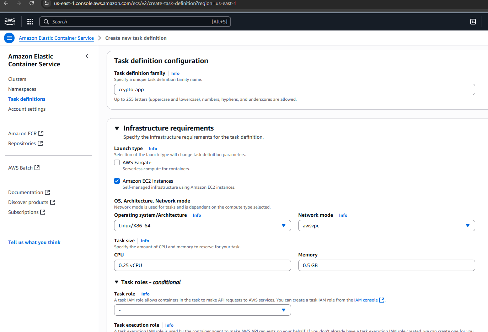

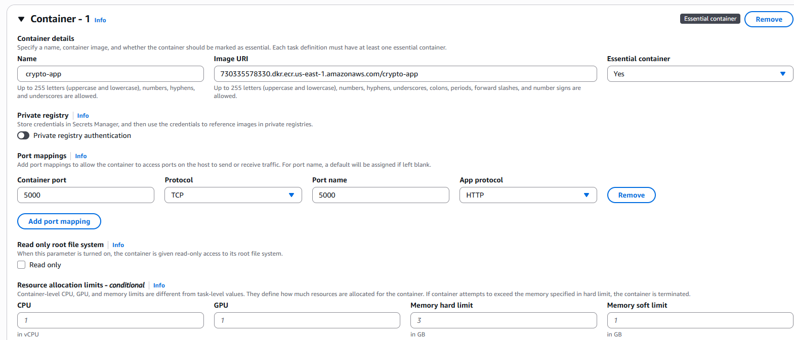


## Create an ECS service

To create an ECS service named crypto-app with the specified details, follow these steps:

  1. Navigate back to the Amazon ECS service page within the AWS Management Console.
  2. Click on "Clusters" in the left navigation pane and select your microservices-cluster.
  3. On the "Services" tab, click "Create".
  4. Select the crypto-app task definition of the latest revision.
  5. Enter crypto-app-service as the service name.
  6. Set the number of desired tasks to 1.
  7. Under "Network configuration", select the default VPC and default subnets that you have selected for the ECS Cluster. For the security group, choose the existing microservices-sg.
  8. Create the Load Balance as well.

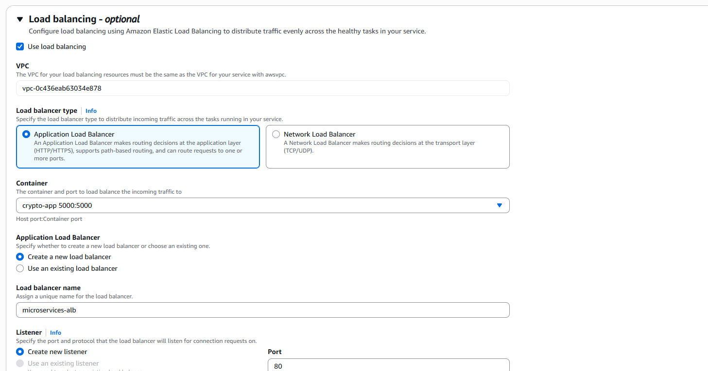

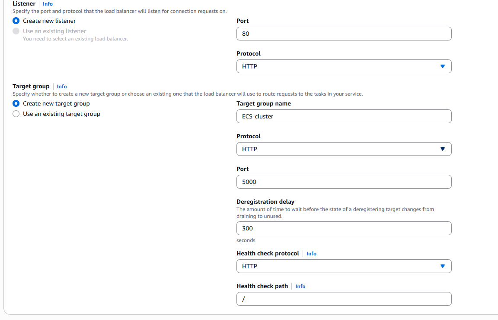

9. Click "Create Service" to finish the setup.

- Note: It may take a few minutes for the service to be up and running, so please be patient.

- Once created. Go to the Application Load Balancer for the DNS name.
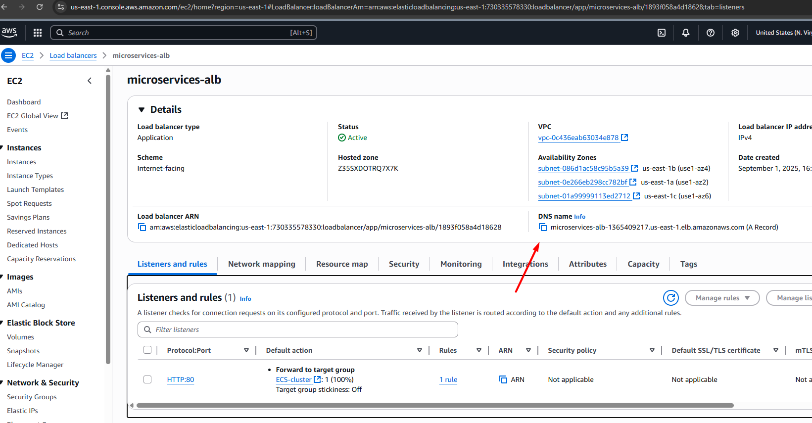

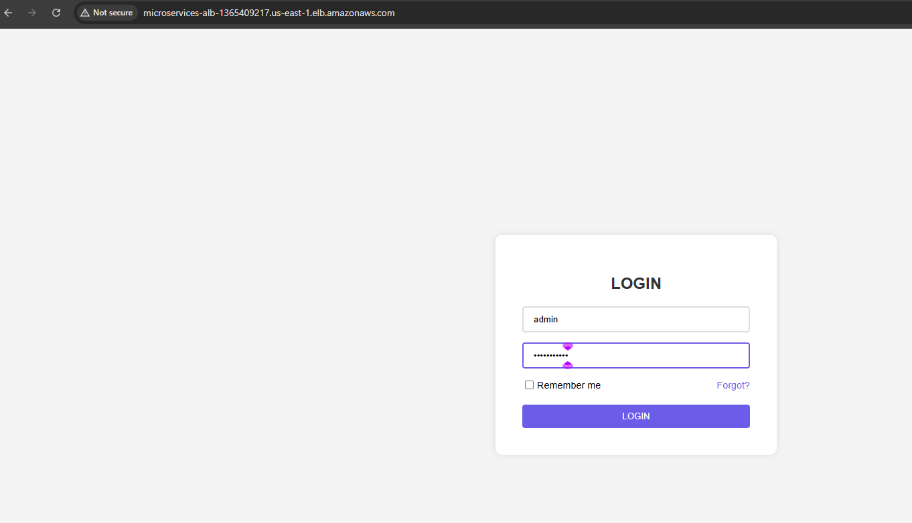

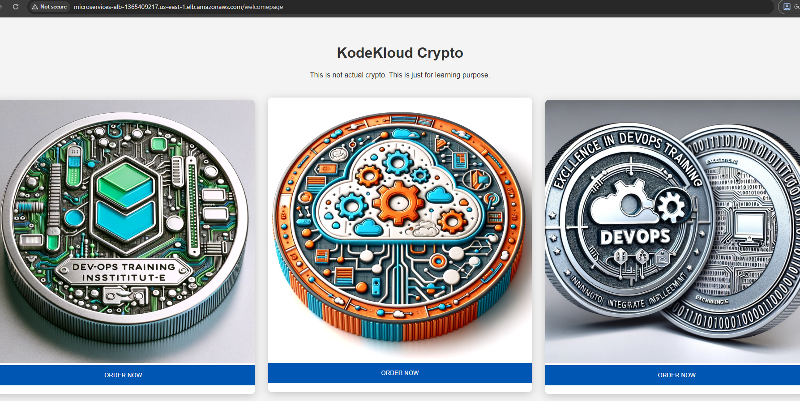

- You can validate the service status by checking the service details:

- After service creation, click on the service name crypto-app and check the status of the service.
In Health and Metrics, Deployments current state should be completed. In case it is not, you can check errors in the Events tab.
- For looking into application logs, click on the Logs tab

-------------------------------------------------------------------------------------------------------------------------------------------------------------------------------------------------------------------------------

## Create a Repo

# Configure the build using the AWS CodeBuild service.

 Create AWS Code Build Project

2. Navigate to AWS Codebuild console and click on “Connections” under settings.

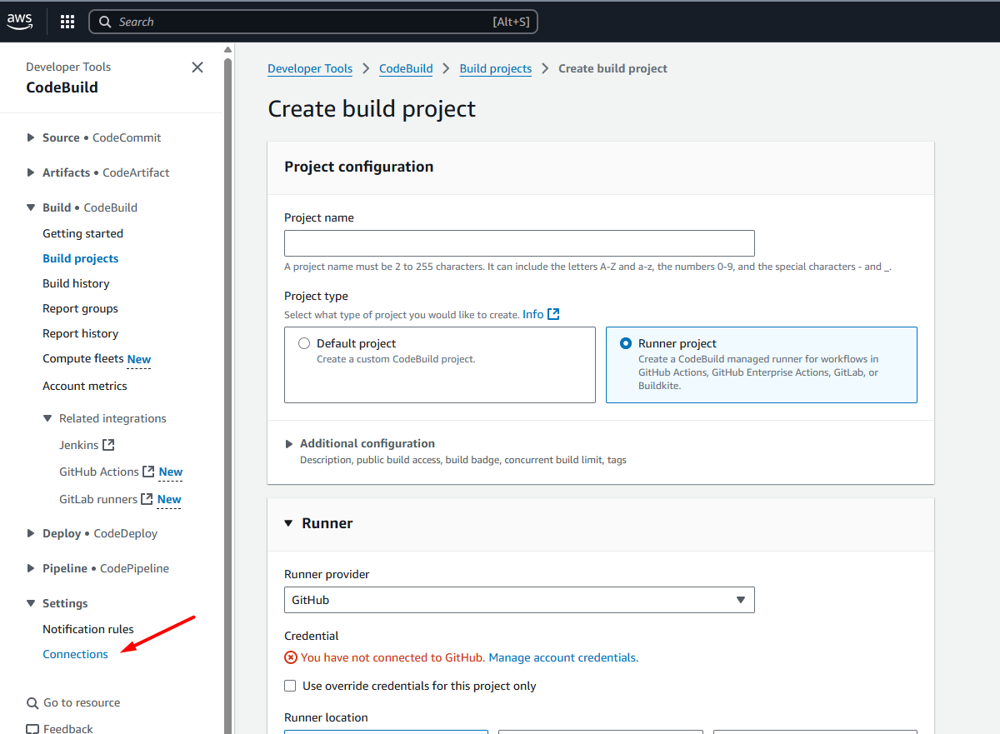


 Give the connection name

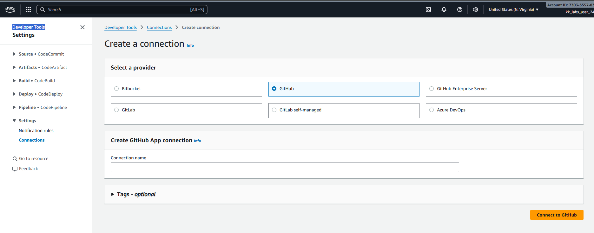

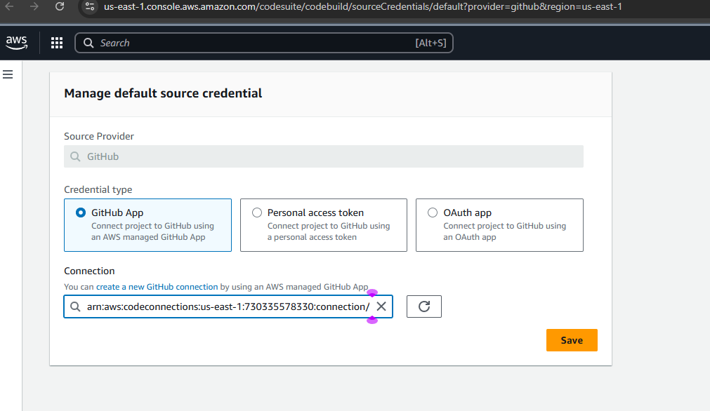


 more info:: https://docs.aws.amazon.com/dtconsole/latest/userguide/connections-create-github.html

3. Then go to the CodeBuild and create a Project

4. Provide a name for it.

5. Under source select github as a source provider.


 

6. Under GitHub repo, select the one your application code relies.

 


7. Under Environment leave all of them as default.

8. Under Buildspec select “Use a buildspec file” and provide the name as “monolith-aws-microservice-project/buildspec.yml”.

9. Under Artifacts Use an already created s3 bucket.

10. Click on “Update project”.


 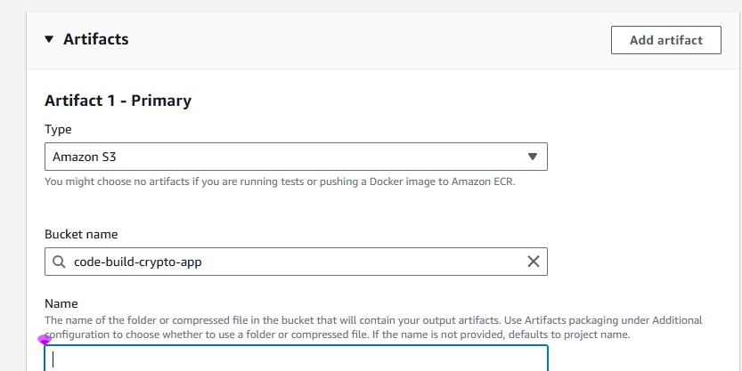


## Update the CodeBuild Role which you will be using.

For a **basic ECS CI/CD pipeline**, you need:
| Permission Type | Purpose | Required For |
| --- | --- | --- |
| ECR Access | Push/pull Docker images | docker push<font class="font0">, </font><font class="font5">docker pull</font> |
| ECS Task Definition | Register new task definitions | aws ecs register-task-definition |
| IAM PassRole | Pass execution role to ECS | Task definitions with <font class="font5">executionRoleArn</font> |
| Secrets Manager | Access Docker credentials | Docker Hub login |
| S3 Access | Store build artifacts | CodePipeline integration |
| CloudWatch Logs | Build logging | CodeBuild execution logs |

If Iam PassRole is not allowed then you can create the Policy with the following and the policy to the CodeBuild Role

```
{
       "Version": "2012-10-17",
       "Statement": [
           {
               "Effect": "Allow",
               "Action": [
                   "ecs:RegisterTaskDefinition",
                   "ecs:DeregisterTaskDefinition",
                   "ecs:ListTaskDefinitions",
                   "ecs:DescribeTaskDefinition"
               ],
               "Resource": "*"
           },
           {
               "Effect": "Allow",
               "Action": "iam:PassRole",
               "Resource": "arn:aws:iam::423207801186:role/ecsTaskExecutionRole",
               "Condition": {
                   "StringEquals": {
                       "iam:PassedToService": "ecs-tasks.amazonaws.com"
                   }
               }
           }
       ]
   }
```


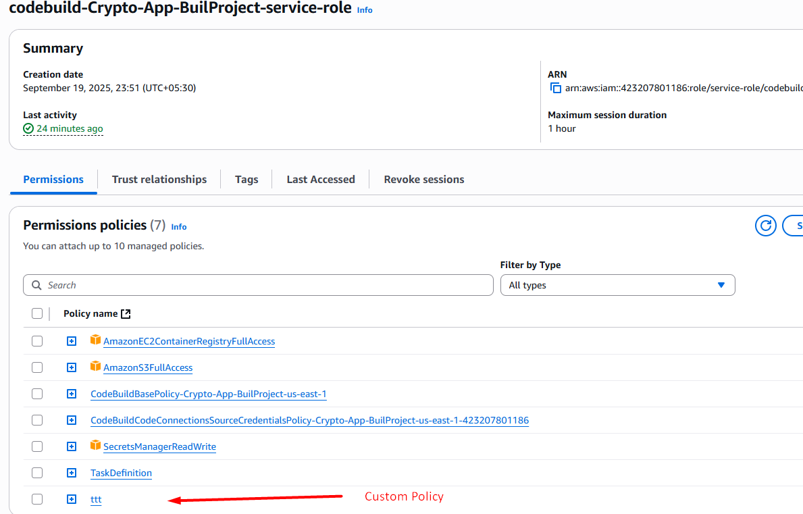


-------------------------------------------------------------------------------------------------------------------------------------------------------------------------------------------------------------------------------

## edit the buildspec.yml  and the task-definition file.

In the pre-build commands section, we need to update the lines below.

```
AWS_ACCOUNT_ID: "123456789012"
AWS_DEFAULT_REGION: "us-west-1"
ECR_REPOSITORY_NAME: "my-app-repo"
ECS_CONTAINER_NAME: "my-app-container"
```

- Update the Task Definition, with your aws ID under images and execution role

And Commit to the repository

-------------------------------------------------------------------------------------------------------------------------------------------------------------


  -------------------------------------------------------------------------------------------------------------------------------------------------------------------------------------------------------------------------------

1) Please navigate to the CodePipeline section in the AWS console and follow the steps outlined below:

 Click on Create Pipeline.
 Under category select Build custom pipeline and click on next.
 In the Settings section, enter the name crypto-app and leave the remaining options at their default settings. Then, click on NEXT.
 In the Add Source Stage section:
```
 a. Select Github self-managed from the drop-down menu under Source Provider.
 b. Click on the connection column and select the connection named github-connection
 b. Enter the repository name as crypto-app.
 c. Specify the branch name as main.
 d. Leave the remaining options at their default settings and click on NEXT.
 In the Add Build Stage section:
 a. Under build provider select other build providers
 a. Select AWS CodeBuild from the build provider drop-down menu.
 b. Set the region to us-east-1.
 c. Enter the project name as crypto-app.
 d. Leave the remaining options at their default settings and click on NEXT.
 In the Add Deploy Stage section:
 a. Select AWS ECS from the drop-down menu.
 b. Ensure the region is set to us-east-1.
 c. Enter the cluster name as awsmicroservice.
 d. Specify the service name as crypto-app.
 e. Enter the image definition file as imagedefinitions.json.
 f. Leave rest of the options default and click on NEXT.
 Review the configuration and click on Create Pipeli
```
2) Action Name :
   Action Provider: Amazon ECS
   Give imagedefinition.json

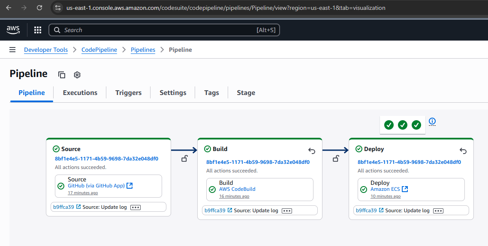

# Testing the Pipeline

-  We will test the pipelin by Changing  the login.html ---> from LOGIN to LOGIN--V2


Before

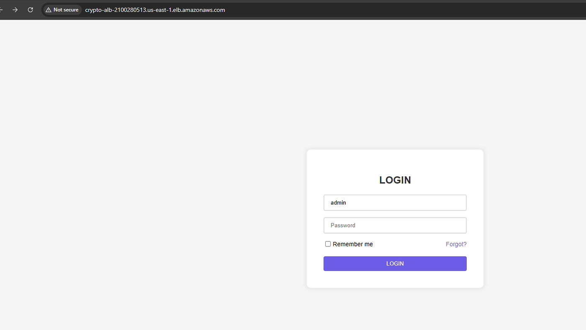

Change in the Login.HTML

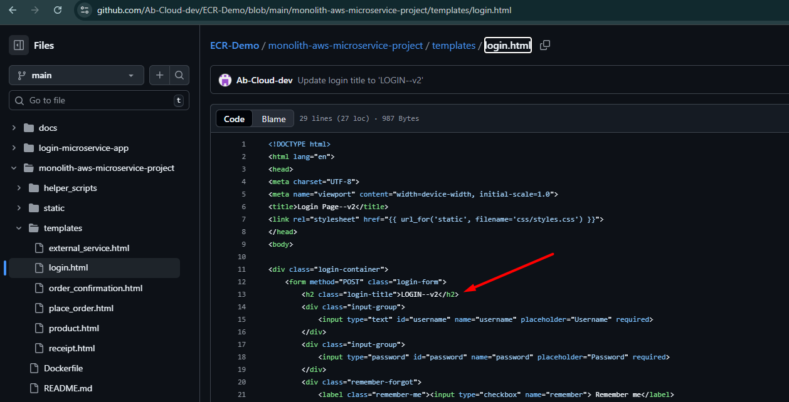

After:

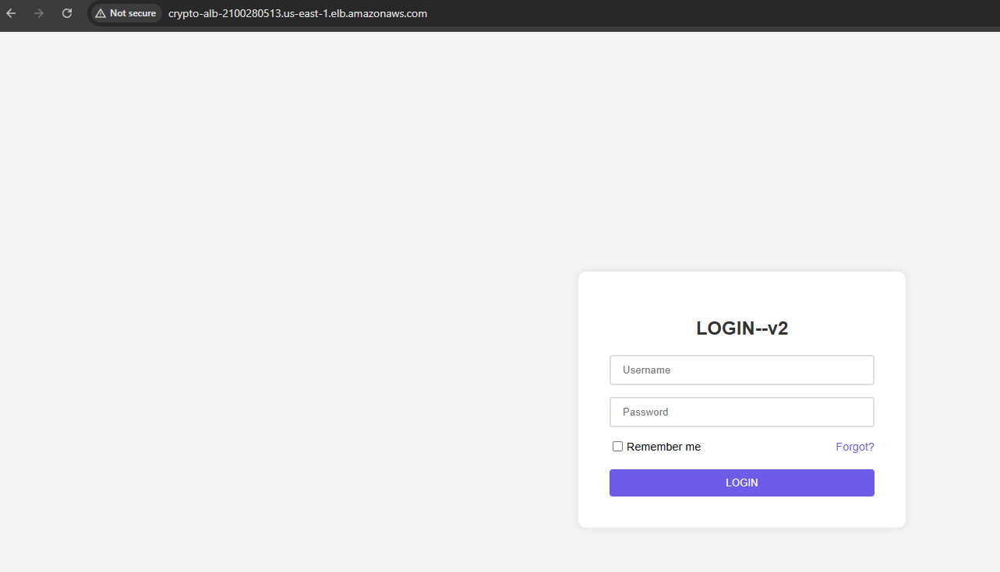


Next Section is to use RDS for storing the credentails.


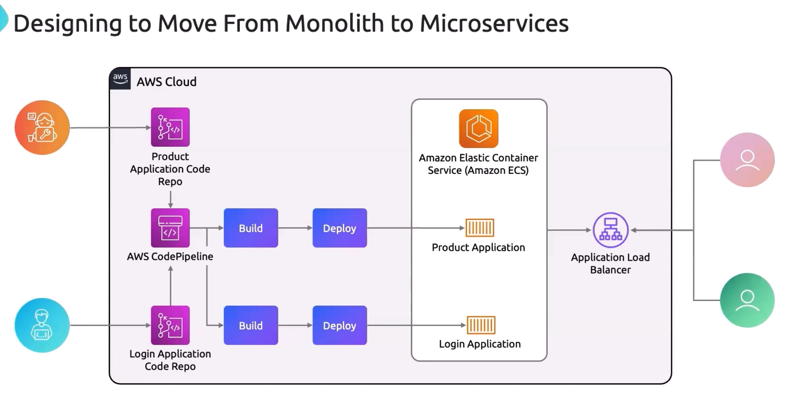

## 1) Create a RDS Instance
- Navigate to the RDS service in the AWS Management Console.
- Click on "Create database".
- Select "Standard Create".
- Choose "PostgesSQL" as the engine type.
- Select the "Free tier" template.
- Configure the following settings:
  - DB instance identifier: `mydbinstance`
   - Master username: `postgres`
   - Master password: `YourPassword123` (replace with a secure password)
   - DB instance class: `db.t2.micro`
   - Storage type: `General Purpose (SSD)`
   - Allocated storage: `20 GB`
   - Public access: `Yes`
   - VPC security group: `Default`
   - Initial database name: `microservice`
- Click "Create database" to launch the instance.

  -