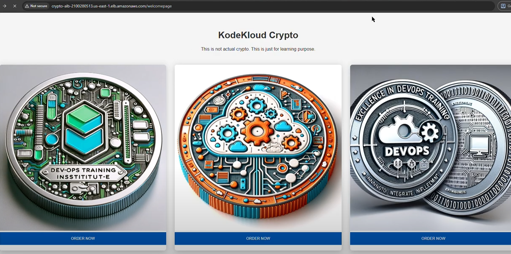
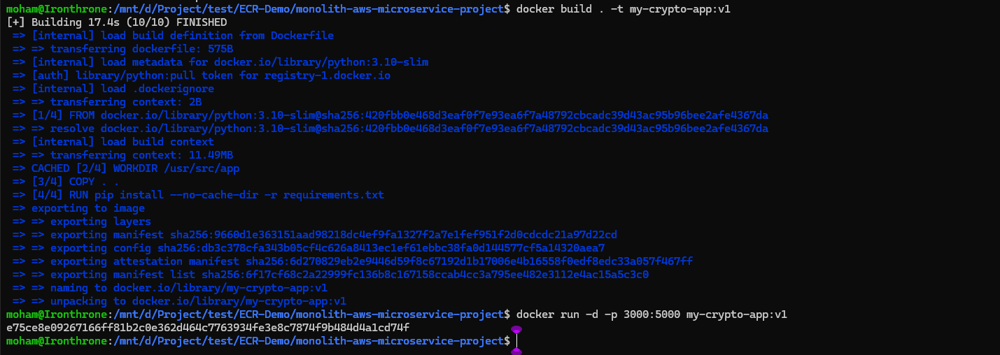

# Containerized Application Deployment with CI/CD on AWS ECS

## 🚀 Live Demo

Check out the live application deployed through this CI/CD pipeline:

[](https://www.youtube.com/watch?v=D1iqkughmFs)

🔗  [Crypto App Demo](https://www.youtube.com/watch?v=D1iqkughmFs)


## Project Overview

This project demonstrates how to create a complete CI/CD pipeline to build, test, and deploy a containerized microservice application using AWS services. The microservice is deployed onto Amazon Elastic Container Service (ECS) for high availability and scalability, with proper configuration of ECS clusters, services, and tasks to efficiently run containers.

## Table of Contents

- [Architecture Overview](#architecture-overview)
- [Implementation Phases](#implementation-phases)
- [Phase 1: Local Development and Testing](#phase-1-local-development-and-testing)
  - [Step 1: Clone the Repository](#step-1-clone-the-repository)
  - [Step 2: Build the Docker Image](#step-2-build-the-docker-image)
  - [Step 3: Run the Docker Container](#step-3-run-the-docker-container)
  - [Step 4: Test the Application](#step-4-test-the-application)
- [Phase 2: AWS Deployment with CI/CD Pipeline](#phase-2-aws-deployment-with-cicd-pipeline)
  - [Step 1: Create ECR Repository](#step-1-create-ecr-repository)
  - [Step 2: Push Docker Image to ECR](#step-2-push-docker-image-to-ecr)
  - [Step 3: Create ECS Cluster](#step-3-create-ecs-cluster)
  - [Step 4: Create Task Definition](#step-4-create-task-definition)
  - [Step 5: Create ECS Service](#step-5-create-ecs-service)
- [CI/CD Pipeline Setup](#cicd-pipeline-setup)
  - [Step 1: Create GitHub Connection](#step-1-create-github-connection)
  - [Step 2: Create CodeBuild Project](#step-2-create-codebuild-project)
  - [Step 3: Configure CodeBuild IAM Permissions](#step-3-configure-codebuild-iam-permissions)

---# CI/CD Pip2. Click on **"Connections"** under **Settings**


3. Create a new connection and provide a connection name


> **Additional Info:** For detailed instructions, refer to the [AWS Documentation](https://docs.aws.amazon.com/dtconsole/latest/userguide/connections-create-github.html)
## Step 1: Create GitHub Connection

### 1.1 Setup GitHub Connection

1. Navigate to AWS CodeBuild console
2. Click on **"Connections"** under **Settings** Elastic Container Service (ECS) for high availability and scalability, with proper configuration of ECS clusters, services, and tasks to efficiently run containers.

## Architecture Overview


## Implementation Phases

This project is divided into two main phases:

### Phase 1: Local Development and Testing
- Clone and set up the project locally
- Build and test the Docker image
- Run the application in a local container

### Phase 2: AWS Deployment with CI/CD
- Deploy the Docker image to Amazon ECR
- Configure ECS cluster, task definitions, and services
- Set up CI/CD pipeline with CodeBuild and CodePipeline
- Access the application through AWS Application Load Balancer

---

# Phase 1: Local Development and Testing

## Step 1: Clone the Repository

First, clone the repository and navigate to the project directory:

```bash
git clone https://github.com/Ab-Cloud-dev/ECR-Demo.git
cd ECR-Demo/monolith-aws-microservice-project/
```

## Step 2: Build the Docker Image

Navigate to the directory containing the Dockerfile and build the Docker image. Replace `your-image-name:tag` with the desired name and tag for your image.

In this example, we'll use `my-crypto-app` as the name and `v1` as the tag:

```bash
docker build . -t my-crypto-app:v1
```



## Step 3: Run the Docker Container

After building the image, run it using the following command. This maps the local port 3000 to the container port 5000:

```bash
docker run -d -p 3000:5000 my-crypto-app:v1
```

## Step 4: Test the Application

With the container running, you can test your application by accessing it via the local port you specified. Open your web browser and navigate to `http://localhost:3000`.


### Application Credentials

Use the following credentials to log in:

```
Username: admin
Password: password123
```


---

# Phase 2: AWS Deployment with CI/CD Pipeline

## Step 1: Create ECR Repository

Create a new Amazon ECR (Elastic Container Registry) repository to store your Docker image:

```bash
aws ecr create-repository --repository-name "crypto-app" --image-scanning-configuration scanOnPush=true --region us-east-1
```

> **Note:** Ensure you have AWS CLI installed and configured with the appropriate credentials before running this command.

## Step 2: Push Docker Image to ECR

### 2.1 Get Push Commands

In the ECR console, select the repository you created and click on **"View Push Commands"** to see the commands needed to push your image.


### 2.2 Authenticate Docker Client

Authenticate your Docker client to the ECR registry:

```bash
aws ecr get-login-password --region us-east-1 | docker login --username AWS --password-stdin <account_id>.dkr.ecr.us-east-1.amazonaws.com
```

### 2.3 Tag the Image

Since we already have a local image, tag it for the ECR repository:

```bash
docker tag my-crypto-app:v1 <account_id>.dkr.ecr.us-east-1.amazonaws.com/crypto-app:latest
```

### 2.4 Push the Image

Push the image to ECR:

```bash
docker push <account_id>.dkr.ecr.us-east-1.amazonaws.com/crypto-app:latest
```


## Step 3: Create ECS Cluster

Create an ECS cluster to run your containerized application. Follow these steps in the AWS Management Console:

### 3.1 Access ECS Console

1. Sign in to the AWS Management Console
2. Navigate to the Amazon ECS service page
3. Click on **"Clusters"** in the left navigation pane
4. Click the **"Create Cluster"** button

### 3.2 Configure Cluster Settings

Provide the following configuration details:

| Setting | Value |
|---------|-------|
| **Cluster name** | `microservices-cluster` |
| **Infrastructure configuration** | Amazon EC2 Instance |
| **Instance type** | On-Demand Instance |
| **Operating System** | Amazon Linux 2 |
| **Instance type** | `t3a.micro` |
| **Instance role** | Create a new role |
| **Min/Max/Desired capacity** | 1/1/3 |
| **SSH key pair** | None |
| **Root EBS volume size** | 30 GB |

### 3.3 Networking Configuration

| Setting | Value |
|---------|-------|
| **VPC** | Default VPC |
| **Subnets** | All Default Subnets (or choose three subnets) |
| **Security group** | Default (ensure it allows all required ports) |
| **Auto-assign public IP** | Enabled |

3. Click **"Create"** to create the ECS cluster


## Step 4: Create Task Definition

## Step 4: Create Task Definition

Create a task definition that specifies how your container should run. Follow these steps:

### 4.1 Access Task Definitions

1. Navigate to the Amazon ECS service page in the AWS Management Console
2. Click on **"Task Definitions"** in the left navigation pane
3. Click the **"Create new Task Definition"** button


### 4.2 Configure Task Definition

Provide the following configuration details:

| Setting | Value |
|---------|-------|
| **Task definition name** | `crypto-app` |
| **Task execution role** | `ecsTaskExecutionRole` |
| **Task memory (GB)** | 0.5 GB |
| **Task CPU (vCPU)** | 0.25 vCPU |

### 4.3 Container Configuration

Click **"Add container"** and configure the container with these settings:

| Setting | Value |
|---------|-------|
| **Container name** | `crypto-app` |
| **Image** | ECR repository URL (e.g., `<account_id>.dkr.ecr.us-east-1.amazonaws.com/crypto-app:latest`) |
| **Container port** | `5000` |
| **Port name** | `5000` |
| **Protocol** | `HTTP` |

### 4.4 Logging Configuration

- **Log configuration**: Select "Auto-configure CloudWatch Logs"
- **Log Group Name**: `/ecs/crypto-app`

Click **"Create"** to create the task definition.


## Step 5: Create ECS Service

Create an ECS service to run and maintain your task definition. Follow these steps:

### 5.1 Navigate to Service Creation

1. Navigate back to the Amazon ECS service page in the AWS Management Console
2. Click on **"Clusters"** in the left navigation pane
3. Select your `microservices-cluster`
4. On the **"Services"** tab, click **"Create"**

### 5.2 Configure Service Settings

| Setting | Value |
|---------|-------|
| **Task Definition** | `crypto-app` (latest revision) |
| **Service name** | `crypto-app-service` |
| **Desired tasks** | `1` |

### 5.3 Network Configuration

| Setting | Value |
|---------|-------|
| **VPC** | Default VPC (same as ECS Cluster) |
| **Subnets** | Default subnets (same as ECS Cluster) |
| **Security group** | `microservices-sg` |
| **Load Balancer** | Create new Application Load Balancer |


5. Click **"Create Service"** to finish the setup

> **Note:** It may take a few minutes for the service to be up and running. Please be patient.

### 5.4 Access the Application

Once the service is created, access your application through the Application Load Balancer:

1. Go to the Application Load Balancer section in the AWS Console
2. Copy the DNS name of your load balancer
3. Open the DNS name in your browser to access the application


### 5.5 Validate Service Status

To verify your service is running correctly:

1. Click on the service name `crypto-app-service`
2. Check the service status in the **Health and Metrics** section
3. Ensure the deployment state shows as **"completed"**
4. If there are issues, check the **Events** tab for error details
5. View application logs in the **Logs** tab

---

# CI/CD Pipeline Setup

 Create AWS Code Build Project

2. Navigate to AWS Codebuild console and click on “Connections” under settings.


 Give the connection name


 more info:: https://docs.aws.amazon.com/dtconsole/latest/userguide/connections-create-github.html

3. Then go to the CodeBuild and create a Project

4. Provide a name for it.

5. Under source select github as a source provider.


 

6. Under GitHub repo, select the one your application code relies.

 


7. Under Environment leave all of them as default.

8. Under Buildspec select “Use a buildspec file” and provide the name as “monolith-aws-microservice-project/buildspec.yml”.

9. Under Artifacts Use an already created s3 bucket.

10. Click on “Update project”.


 


## Update the CodeBuild Role which you will be using.

For a **basic ECS CI/CD pipeline**, you need:
| Permission Type | Purpose | Required For |
| --- | --- | --- |
| ECR Access | Push/pull Docker images | docker push<font class="font0">, </font><font class="font5">docker pull</font> |
| ECS Task Definition | Register new task definitions | aws ecs register-task-definition |
| IAM PassRole | Pass execution role to ECS | Task definitions with <font class="font5">executionRoleArn</font> |
| Secrets Manager | Access Docker credentials | Docker Hub login |
| S3 Access | Store build artifacts | CodePipeline integration |
| CloudWatch Logs | Build logging | CodeBuild execution logs |

If Iam PassRole is not allowed then you can create the Policy with the following and the policy to the CodeBuild Role

```
{
       "Version": "2012-10-17",
       "Statement": [
           {
               "Effect": "Allow",
               "Action": [
                   "ecs:RegisterTaskDefinition",
                   "ecs:DeregisterTaskDefinition",
                   "ecs:ListTaskDefinitions",
                   "ecs:DescribeTaskDefinition"
               ],
               "Resource": "*"
           },
           {
               "Effect": "Allow",
               "Action": "iam:PassRole",
               "Resource": "arn:aws:iam::423207801186:role/ecsTaskExecutionRole",
               "Condition": {
                   "StringEquals": {
                       "iam:PassedToService": "ecs-tasks.amazonaws.com"
                   }
               }
           }
       ]
   }
```


-------------------------------------------------------------------------------------------------------------------------------------------------------------------------------------------------------------------------------

## edit the buildspec.yml  and the task-definition file.

In the pre-build commands section, we need to update the lines below.

```
AWS_ACCOUNT_ID: "123456789012"
AWS_DEFAULT_REGION: "us-west-1"
ECR_REPOSITORY_NAME: "my-app-repo"
ECS_CONTAINER_NAME: "my-app-container"
```

- Update the Task Definition, with your aws ID under images and execution role

And Commit to the repository

-------------------------------------------------------------------------------------------------------------------------------------------------------------


  -------------------------------------------------------------------------------------------------------------------------------------------------------------------------------------------------------------------------------

1) Please navigate to the CodePipeline section in the AWS console and follow the steps outlined below:

 Click on Create Pipeline.
 Under category select Build custom pipeline and click on next.
 In the Settings section, enter the name crypto-app and leave the remaining options at their default settings. Then, click on NEXT.
 In the Add Source Stage section:
```
 a. Select Github self-managed from the drop-down menu under Source Provider.
 b. Click on the connection column and select the connection named github-connection
 b. Enter the repository name as crypto-app.
 c. Specify the branch name as main.
 d. Leave the remaining options at their default settings and click on NEXT.
 In the Add Build Stage section:
 a. Under build provider select other build providers
 a. Select AWS CodeBuild from the build provider drop-down menu.
 b. Set the region to us-east-1.
 c. Enter the project name as crypto-app.
 d. Leave the remaining options at their default settings and click on NEXT.
 In the Add Deploy Stage section:
 a. Select AWS ECS from the drop-down menu.
 b. Ensure the region is set to us-east-1.
 c. Enter the cluster name as awsmicroservice.
 d. Specify the service name as crypto-app.
 e. Enter the image definition file as imagedefinitions.json.
 f. Leave rest of the options default and click on NEXT.
 Review the configuration and click on Create Pipeli
```
2) Action Name :
   Action Provider: Amazon ECS
   Give imagedefinition.json


# Testing the Pipeline

-  We will test the pipelin by Changing  the login.html ---> from LOGIN to LOGIN--V2


Before


Change in the Login.HTML


After:


Next Section is to use RDS for storing the credentails.


## 1) Create a RDS Instance
- Navigate to the RDS service in the AWS Management Console.
- Click on "Create database".
- Select "Standard Create".
- Choose "PostgesSQL" as the engine type.
- Select the "Free tier" template.
- Configure the following settings:
  - DB instance identifier: `mydbinstance`
   - Master username: `postgres`
   - Master password: `YourPassword123` (replace with a secure password)
   - DB instance class: `db.t2.micro`
   - Storage type: `General Purpose (SSD)`
   - Allocated storage: `20 GB`
   - Public access: `Yes`
   - VPC security group: `Default`
   - Initial database name: `microservice`
- Click "Create database" to launch the instance.

  -