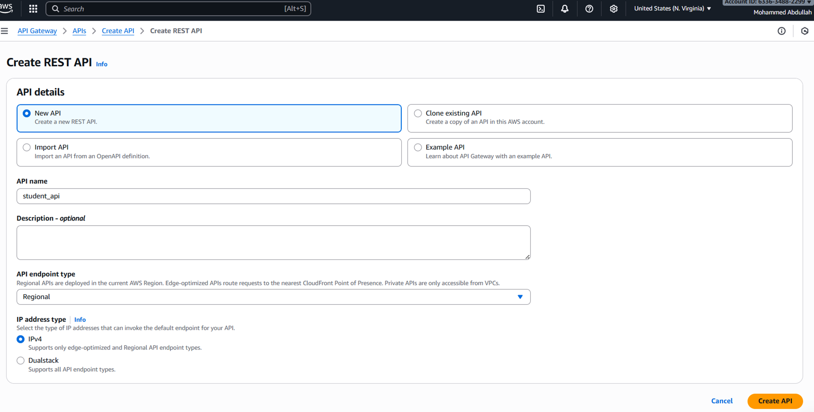
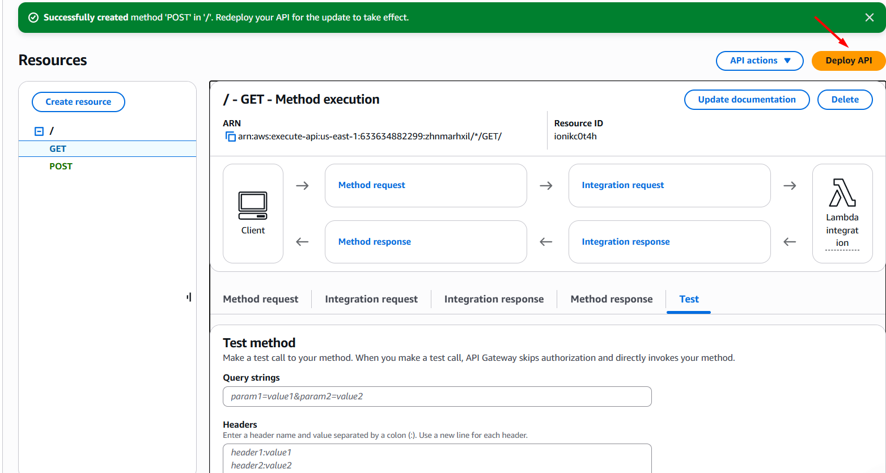
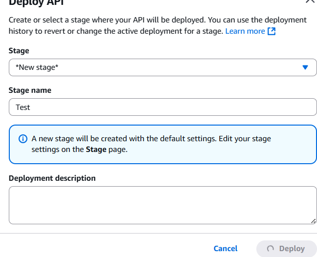
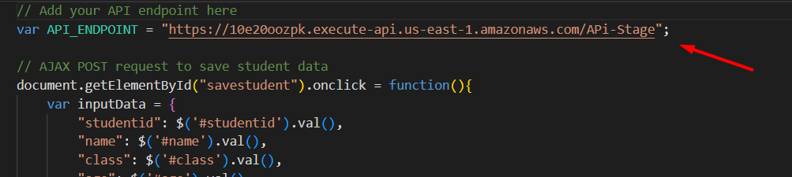
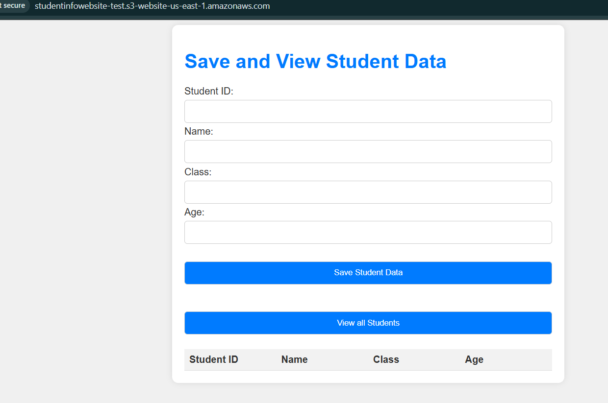
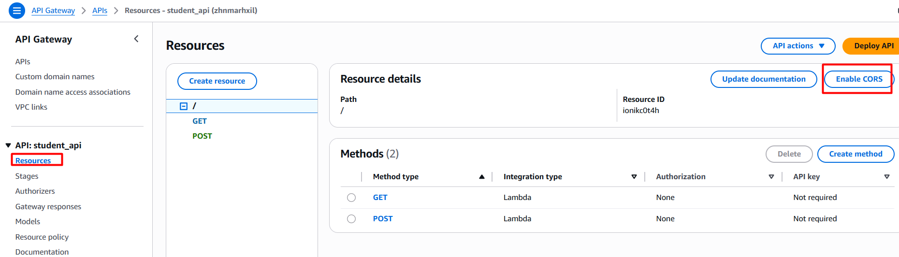
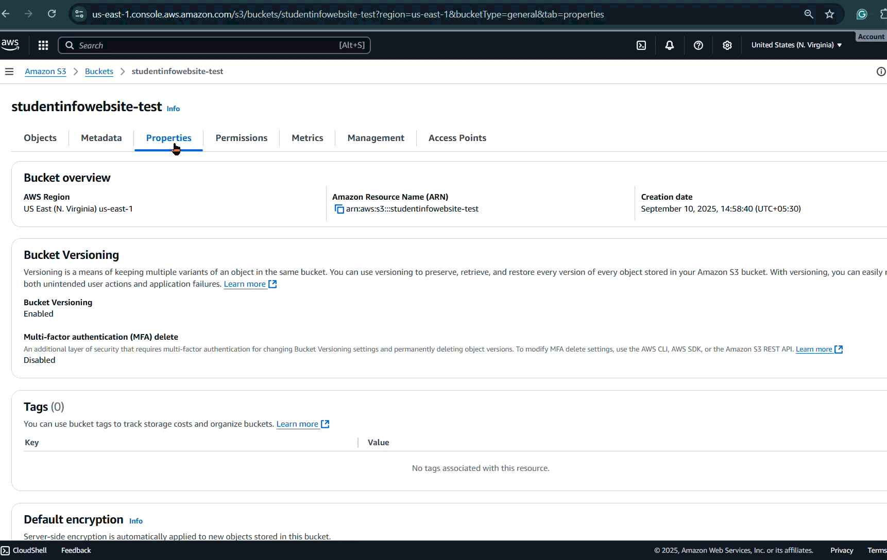

## 1) First Creating the DynamoDB with the student as partition key

```
aws application-autoscaling put-scaling-policy --service-namespace 'dynamodb' --resource-id 'table/console_e264d683-c20f-45b9-bbfa-fcf2dc7cc743;' --scalable-dimension 'dynamodb:table:ReadCapacityUnits' --policy-name 'console_e264d683-c20f-45b9-bbfa-fcf2dc7cc743;-scaling-policy' --policy-type 'TargetTrackingScaling' --target-tracking-scaling-policy-configuration '{"PredefinedMetricSpecification":{"PredefinedMetricType":"DynamoDBReadCapacityUtilization"},"TargetValue":70}' 
```

```
aws dynamodb create-table --table-name 'Student' --attribute-definitions '{"AttributeName":"studentid","AttributeType":"S"}' --billing-mode 'PAY_PER_REQUEST' --key-schema '{"AttributeName":"studentid","KeyType":"HASH"}' --table-class 'STANDARD'
```

## 2) Create an Roles

Name- studentlambdarole
Select Trust Entity -- Lambda
Policies -- AWSLambdaBasicExecutionRole
            AmazonDynamoDBFullAccess

Description : Allows Lambda functions to call AWS services on your behalf.

## 3) Create Lambda

Function Name: getStudent

Runtime: Python 3.13
Architecture x86_64
Execution Role: studentlambdarole




## 4) Provisioning Lambda Code 
- Add code : script Name : Python-get-Student.py
- edit the dynamodb table name in the script, our case it is 'Student'
- Click deploy

## 5) Create another Lambda Function 

Name: insertStudent
Runtime: Python3.13
Architecture x86_64

Execution Role: studentlambdarole
```
    You can test 
    
    {
            "studentid": "002",
            "name": "test",
            "class": "6",
            "age": "age"

}

```

You should see in the DynamoDB table(under explore table option)

and retrieve same test by using the getStudent Lambda and simply click Test

## 6) Create a Rest API for triggerring the Lambada that gets the data in the Dynamodb

- Api Name: student_api
- Integration type: Lambda
- Lambda Function : Selecting the lambda which gets the data 

Then create a method for Getting the data by following below 


You can also test it By clicking to the test 


## 7) Create a REST API for triggerring the Lambda that puts the data in the Dynamodb

Select the API Student in our case it is ***student_api*** and select **create method**


Then create a method for Posting the data by following below:


You can also test by putting the data and reteriving it from the GET API as shown 

```
{
            "studentid": "003",
            "name": "test03",
            "class": "6",
            "age": "20"
}
```


Then Finally Deploy the API GATEWAY to get the URL for both of the API gateway




## 8) Insert API URL into script.js

- Copy the API Endpoint URL


- Open the script.js file and paste the URL in the respective places




## 9) Create an S3 Bucket and upload the index.html

- And upload the Index.html and script.html
- Make Sure unblock the Public Access ACL on the S3 Bucket
- Enable the Static Webhosting by going into the S3 bucket Porperties 


- Attach getobject S3 permission by creating a policy and attach that policy to the S3
- Make sure that the ARN is proper 

```
{
    "Version": "2012-10-17",
    "Statement": [
        {
            "Sid": "PublicReadGetObject",
            "Effect": "Allow",
            "Principal": "*",
            "Action": [
                "s3:GetObject"
            ],
            "Resource": [
                "arn:aws:s3:::studentinfowebsite-test/*"
            ]
        }
    ]
}
```
Now you should be able to access the S3 URL 



But we are still unable to get and put the data from s3 static website. You should be getting the error.


we have to Enable the CORS for both GET and POST API gateway.

What is CORS?

In the Context of REST APIs:
REST APIs often serve data to various client applications (web, mobile, desktop) that might be hosted on different origins. CORS is essential for enabling these clients to securely interact with the API while adhering to browser security policies. API developers configure CORS on the API server to explicitly define which origins are permitted to access the API's resources.



And now you should be able to access to get and put the data.


 

