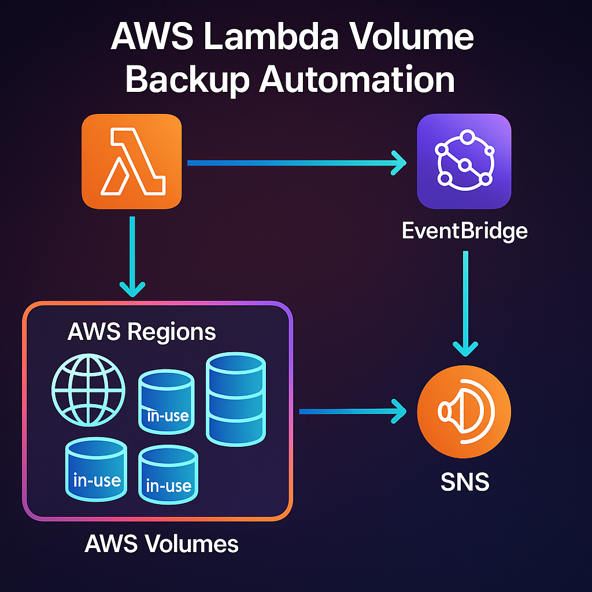
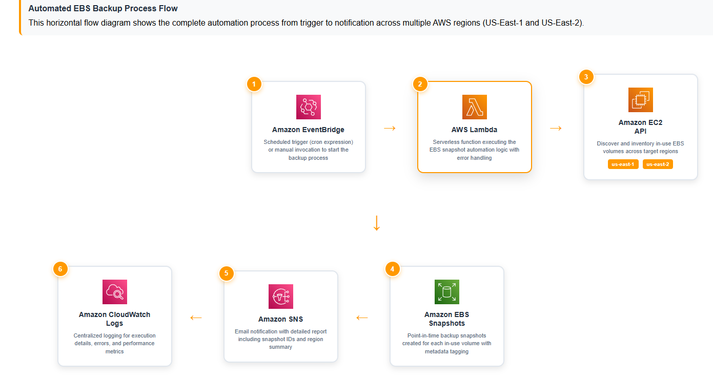

# AWS EBS Snapshot Automation with Lambda

## 📋 Project Overview

This project automates the creation of EBS (Elastic Block Store) snapshots across multiple AWS regions using AWS Lambda and sends detailed email notifications via SNS. The solution provides automated backup capabilities for EC2 instances, ensuring data protection and disaster recovery readiness.



## 🏗️ Architecture

The solution consists of the following components:

- **AWS Lambda**: Serverless function that orchestrates the snapshot creation process
- **Amazon EC2**: Source of EBS volumes to be backed up
- **Amazon SNS**: Notification service for email alerts
- **Amazon CloudWatch**: Monitoring and scheduling (via EventBridge)



## ✨ Features

- ✅ **Multi-Region Support**: Processes EBS volumes in us-east-1 and us-east-2
- ✅ **Intelligent Filtering**: Only snapshots in-use (attached) volumes
- ✅ **Comprehensive Reporting**: Detailed email notifications with snapshot information
- ✅ **Error Handling**: Robust error handling with detailed logging
- ✅ **Cost Optimization**: Selective region processing to minimize API calls
- ✅ **Automated Scheduling**: Can be triggered via CloudWatch Events

## 🛠️ Prerequisites

Before deploying this solution, ensure you have:

- AWS Account with appropriate permissions
- AWS CLI configured
- Basic understanding of AWS Lambda, EC2, and SNS
- Email address for notifications

## 📁 Project Structure

```
aws-ebs-snapshot-automation/
├── README.md
├── src/
│   └── lambda_function.py
├── images/
│   ├── architecture-diagram.png
│   ├── architecture-flow.png
│   ├── lambda-creation.png
│   ├── lambda-configuration.png
│   ├── sns-topic-setup.png
│   ├── iam-permissions.png
│   ├── email-notification.png
│   └── cloudwatch-logs.png
├── docs/
│   └── code-explanation.md
└── deploy/
    └── cloudformation-template.yaml
```

## 🚀 Implementation Steps

### Step 1: Create SNS Topic

1. Navigate to AWS SNS Console
2. Click "Create topic"
3. Choose "Standard" topic type
4. Enter topic name: `ebs-snapshot-notifications`


5. Create the topic and note down the ARN
6. Create subscription with your email address

### Step 2: Create IAM Role for Lambda

Create an IAM role with the following permissions:

```json
{
    "Version": "2012-10-17",
    "Statement": [
        {
            "Effect": "Allow",
            "Action": [
                "logs:CreateLogGroup",
                "logs:CreateLogStream",
                "logs:PutLogEvents"
            ],
            "Resource": "arn:aws:logs:*:*:*"
        },
        {
            "Effect": "Allow",
            "Action": [
                "ec2:DescribeRegions",
                "ec2:DescribeVolumes",
                "ec2:CreateSnapshot",
                "ec2:CreateTags"
            ],
            "Resource": "*"
        },
        {
            "Effect": "Allow",
            "Action": [
                "sns:Publish"
            ],
            "Resource": "arn:aws:sns:*:*:ebs-snapshot-notifications"
        }
    ]
}
```


### Step 3: Create Lambda Function

1. Go to AWS Lambda Console
2. Click "Create function"
3. Choose "Author from scratch"
4. Configure function:
   - **Function name**: `ebs-snapshot-automation`
   - **Runtime**: Python 3.10
   - **Architecture**: x86_64
   - **Execution role**: Use existing role created in Step 2


### Step 4: Configure Lambda Function

1. **Set Timeout**: Change from 3 seconds to 5 minutes (300 seconds)
2. **Set Memory**: Increase to 512 MB for better performance
3. **Add Environment Variable**:
   - Key: `SNS_TOPIC_ARN`
   - Value: Your SNS topic ARN from Step 1


### Step 5: Deploy the Code

Copy the following code into your Lambda function:

```python
import boto3
import json
import datetime

def lambda_handler(event, context):
    # Only process US East regions
    regions = ['us-east-1', 'us-east-2']

    snapshots_created = []
    timestamp = datetime.datetime.now().strftime("%Y-%m-%d_%H-%M-%S")

    for region in regions:
        ec2 = boto3.client('ec2', region_name=region)
        try:
            volumes = ec2.describe_volumes(Filters=[{'Name': 'status', 'Values': ['in-use']}])['Volumes']
            for volume in volumes:
                volume_id = volume['VolumeId']
                snapshot = ec2.create_snapshot(
                    VolumeId=volume_id,
                    Description=f"Snapshot of {volume_id} - {timestamp}"
                )
                snapshots_created.append({
                    "Region": region,
                    "VolumeId": volume_id,
                    "SnapshotId": snapshot['SnapshotId']
                })
        except Exception as e:
            print(f"Error in region {region}: {str(e)}")

    # SNS notification with readable format
    sns = boto3.client('sns')

    # Create readable email message
    total_snapshots = len(snapshots_created)
    subject = f"EBS Snapshot Report - {total_snapshots} snapshots created"

    # Build readable message
    message = f"""
EBS SNAPSHOT CREATION REPORT
============================
Date: {timestamp}
Regions Processed: us-east-1, us-east-2
Total Snapshots Created: {total_snapshots}

SNAPSHOT DETAILS:
"""

    if snapshots_created:
        # Group by region for better readability
        us_east_1_snapshots = [s for s in snapshots_created if s['Region'] == 'us-east-1']
        us_east_2_snapshots = [s for s in snapshots_created if s['Region'] == 'us-east-2']

        if us_east_1_snapshots:
            message += f"\n📍 US-EAST-1 ({len(us_east_1_snapshots)} snapshots):\n"
            message += "-" * 50 + "\n"
            for snapshot in us_east_1_snapshots:
                message += f"  • Volume: {snapshot['VolumeId']}\n"
                message += f"    Snapshot: {snapshot['SnapshotId']}\n\n"

        if us_east_2_snapshots:
            message += f"\n📍 US-EAST-2 ({len(us_east_2_snapshots)} snapshots):\n"
            message += "-" * 50 + "\n"
            for snapshot in us_east_2_snapshots:
                message += f"  • Volume: {snapshot['VolumeId']}\n"
                message += f"    Snapshot: {snapshot['SnapshotId']}\n\n"
    else:
        message += "\nNo snapshots were created (no in-use volumes found).\n"

    message += f"""
SUMMARY:
========
✅ Total Snapshots: {total_snapshots}
🗂️  Regions Checked: 2 (us-east-1, us-east-2)
📅 Created: {timestamp}

This is an automated report from AWS Lambda EBS Snapshot function.
"""

    sns.publish(
        TopicArn="arn:aws:sns:REGION:ACCOUNT_ID:TOPIC_NAME",  # Replace with your actual SNS topic ARN
        Subject=subject,
        Message=message
    )

    return {
        'statusCode': 200,
        'body': json.dumps(snapshots_created)
    }
```

### Step 6: Test the Function

1. Click "Test" in the Lambda console
2. Create a test event (use default template)
3. Run the test and verify:
   - Function executes successfully
   - Snapshots are created in EC2 console
   - Email notification is received

### Step 7: Set Up Automated Scheduling (Optional)

Create CloudWatch Event Rule to run the function automatically:

1. Go to Amazon EventBridge Console
2. Create new rule
3. Set schedule expression (e.g., `rate(1 day)` for daily backups)
4. Add Lambda function as target

## 📊 Monitoring and Logs

Monitor your function using CloudWatch:


- **CloudWatch Logs**: View execution logs and error messages
- **CloudWatch Metrics**: Monitor execution duration, errors, and invocations
- **SNS Delivery Status**: Track email notification success/failure

## 📧 Email Notification Sample

The function sends formatted email notifications:


```
Subject: EBS Snapshot Report - 3 snapshots created

EBS SNAPSHOT CREATION REPORT
============================
Date: 2025-08-20_14-30-45
Regions Processed: us-east-1, us-east-2
Total Snapshots Created: 3

SNAPSHOT DETAILS:

📍 US-EAST-1 (2 snapshots):
--------------------------------------------------
  • Volume: vol-1234567890abcdef0
    Snapshot: snap-0abcdef1234567890

  • Volume: vol-0987654321fedcba0
    Snapshot: snap-1fedcba0987654321

📍 US-EAST-2 (1 snapshots):
--------------------------------------------------
  • Volume: vol-2468135790acbdfe0
    Snapshot: snap-7890acbdfe2468135

SUMMARY:
========
✅ Total Snapshots: 3
🗂️  Regions Checked: 2 (us-east-1, us-east-2)
📅 Created: 2025-08-20_14-30-45

This is an automated report from AWS Lambda EBS Snapshot function.
```

## 🔧 Configuration Options

### Environment Variables

| Variable        | Description                 | Example                                            |
| --------------- | --------------------------- | -------------------------------------------------- |
| `SNS_TOPIC_ARN` | SNS topic for notifications | `arn:aws:sns:us-east-1:123456789012:ebs-snapshots` |

### Customization Options

- **Regions**: Modify the `regions` list to include additional regions
- **Volume Filters**: Adjust filters to target specific volume types or tags
- **Notification Format**: Customize email message format
- **Scheduling**: Set up different schedules for different volume types

## 💰 Cost Considerations

- **Lambda Execution**: Minimal cost for short execution times
- **EBS Snapshots**: Storage costs based on snapshot size and retention
- **SNS**: Minimal cost for email notifications
- **API Calls**: EC2 API calls are free within limits

## 🚨 Troubleshooting

### Common Issues

1. **Permission Denied**
   
   - Verify IAM role has required permissions
   - Check SNS topic policy allows Lambda to publish

2. **Timeout Errors**
   
   - Increase Lambda timeout setting
   - Consider processing fewer regions per execution

3. **No Email Received**
   
   - Verify SNS topic ARN in environment variable
   - Check email subscription confirmation
   - Review CloudWatch logs for SNS errors

4. **Snapshots Not Created**
   
   - Verify EC2 volumes exist and are in-use
   - Check CloudWatch logs for API errors
   - Ensure Lambda has EC2 permissions

## 🔒 Security Best Practices

- ✅ Use least-privilege IAM roles
- ✅ Enable CloudTrail for API logging
- ✅ Encrypt snapshots at rest
- ✅ Regular review of access permissions
- ✅ Use VPC endpoints for enhanced security

## 📈 Future Enhancements

- [ ] Add snapshot lifecycle management (automatic deletion of old snapshots)
- [ ] Implement cross-region snapshot copying for disaster recovery
- [ ] Add Slack/Teams integration for notifications
- [ ] Create dashboard for snapshot metrics
- [ ] Add cost optimization recommendations
- [ ] Implement snapshot verification and integrity checks

## 🤝 Contributing

1. Fork the repository
2. Create a feature branch (`git checkout -b feature/amazing-feature`)
3. Commit your changes (`git commit -m 'Add some amazing feature'`)
4. Push to the branch (`git push origin feature/amazing-feature`)
5. Open a Pull Request

## 📄 License

This project is licensed under the MIT License - see the [LICENSE](LICENSE) file for details.

## 📞 Contact

Your Name - [your.email@example.com](mailto:your.email@example.com)

Project Link: [https://github.com/yourusername/aws-ebs-snapshot-automation](https://github.com/yourusername/aws-ebs-snapshot-automation)

## 🙏 Acknowledgments

- AWS Documentation and Best Practices
- AWS Lambda Python Runtime
- Community feedback and contributions

---

⭐ **If you found this project helpful, please consider giving it a star!**
